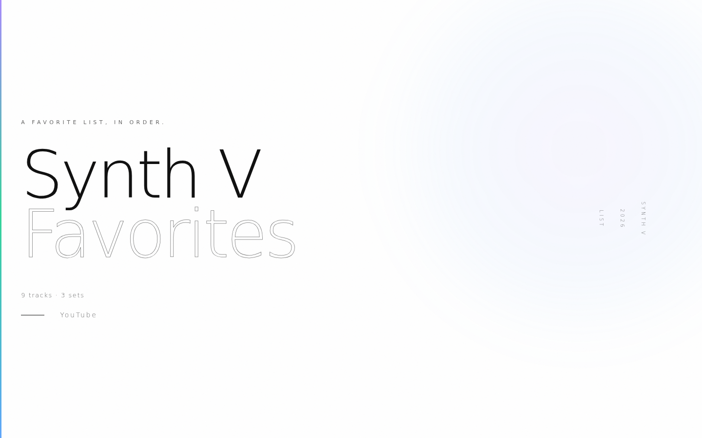
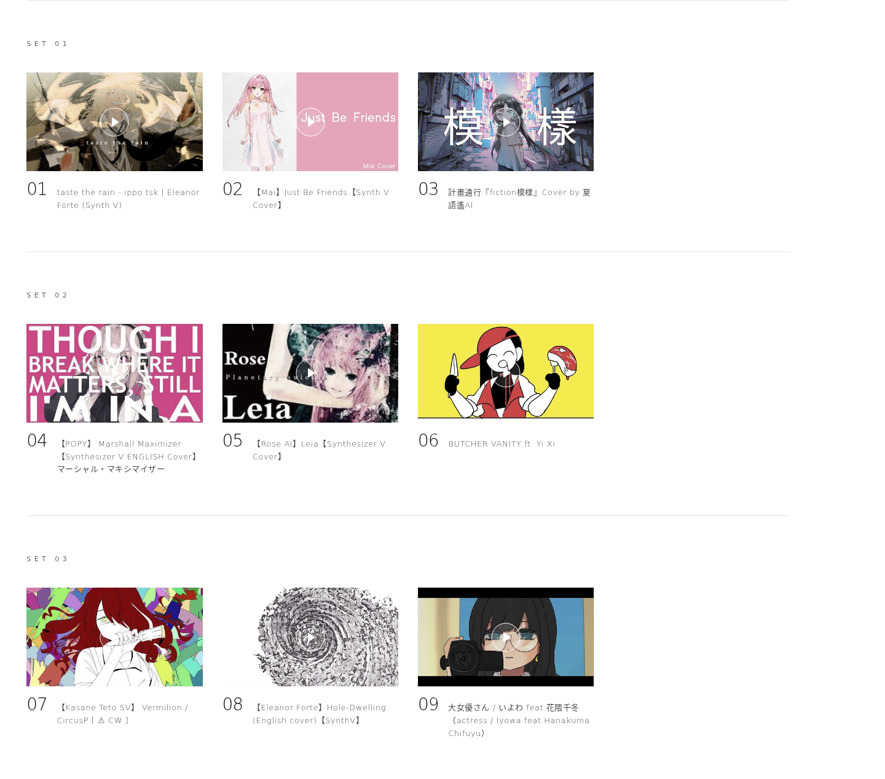
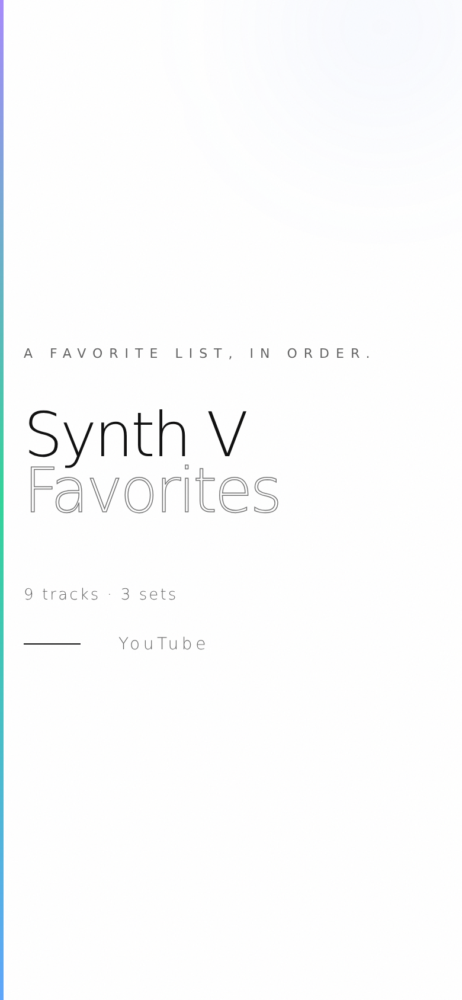
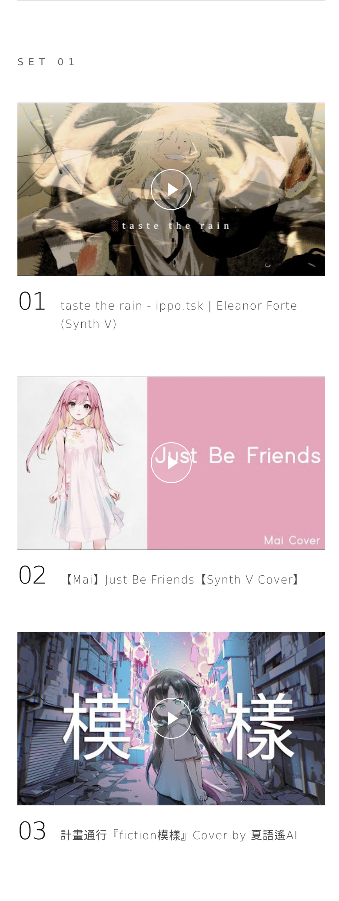

# Synth V Favorites

[English](README.md) | 简体中文

一份用 Synthesizer V 演唱的私人歌单，收录原创曲与翻唱曲，直接从 YouTube 播放，按固定顺序排列。

在线收听：**https://voca-synth.github.io/my-synthv-list/**，也可以[做一份你自己的歌单](#做一份你自己的歌单)。



## 曲目

共九首，分为三组，建议按顺序聆听。曲名保留原曲语言，后附通行的英文或日文标题。歌手名以日文和英文标注，中文歌手保留中文名，常见的中文译名写在括号里。

| 组 | # | | 曲名 | 歌手 | 原创 / 翻唱 |
|---|---|---|---|---|---|
| 01 | 01 | <a href="https://www.youtube.com/watch?v=H7_1LDku7sg"></a> | [taste the rain](https://www.youtube.com/watch?v=H7_1LDku7sg) | エレノア・フォルテ / Eleanor Forte | ippo.tsk 原创 |
| 01 | 02 | <a href="https://www.youtube.com/watch?v=KUy2Es4d4CQ"></a> | [Just Be Friends](https://www.youtube.com/watch?v=KUy2Es4d4CQ) | Mai | 翻唱，原曲 Dixie Flatline feat. 巡音ルカ（巡音流歌）。调校：Jim |
| 01 | 03 | <a href="https://www.youtube.com/watch?v=By-a9NeeHzE"></a> | [fiction模樣](https://www.youtube.com/watch?v=By-a9NeeHzE) | 夏語遙（夏语遥）/ Xia Yuyao | 翻唱，原曲为台湾乐团 計畫通行。调校：Hugwalk（VOICEMITH） |
| 02 | 04 | <a href="https://www.youtube.com/watch?v=cQLzNtaZTxw"></a> | [マーシャル・マキシマイザー (Marshall Maximizer)](https://www.youtube.com/watch?v=cQLzNtaZTxw) | POPY | 英文翻唱，原曲 柊マグネタイト (Hiiragi Magnetite) feat. 可不 (KAFU)。英文词：Bread Box，调校：LuvP |
| 02 | 05 | <a href="https://www.youtube.com/watch?v=74rKqbs-E1Y"></a> | [Leia](https://www.youtube.com/watch?v=74rKqbs-E1Y) | ROSE | 翻唱，原曲 ゆよゆっぺ (Yuyoyuppe) feat. 巡音ルカ（巡音流歌）。调校：連殤 |
| 02 | 06 | <a href="https://www.youtube.com/watch?v=vjBFftpQxxM"></a> | [BUTCHER VANITY](https://www.youtube.com/watch?v=vjBFftpQxxM) | 奕夕 / Yi Xi | FLAVOR FOLEY（Vane Lily、Jamie Paige、ricedeity）原创 |
| 03 | 07 | <a href="https://www.youtube.com/watch?v=wFLn_d51bNc"></a> | [Vermilion](https://www.youtube.com/watch?v=wFLn_d51bNc) | 重音テト（重音Teto）/ Kasane Teto | Circus (CircusP) 原创，收录于专辑 DAEMON/DOLL |
| 03 | 08 | <a href="https://www.youtube.com/watch?v=jU_CG_FF6WI"></a> | [あなぐらぐらし (Hole-Dwelling)](https://www.youtube.com/watch?v=jU_CG_FF6WI) | エレノア・フォルテ / Eleanor Forte | 英文翻唱，原曲 Kikuo feat. 初音ミク（初音未来）。英文词与调校：GumiWorms |
| 03 | 09 | <a href="https://www.youtube.com/watch?v=wdNjJ3eh8EQ"></a> | [大女優さん (actress)](https://www.youtube.com/watch?v=wdNjJ3eh8EQ) | 花隈千冬 / Hanakuma Chifuyu | いよわ (Iyowa) 原创 |

以上歌手均为 Synthesizer V 声库。被翻唱曲目的原唱是 VOCALOID 或 CeVIO 声库，只有 計畫通行 的原曲由乐团主唱本人演唱。



## 初衷

Synthesizer V 的作品分散在各个频道、语言和曲风里，喜欢的歌很容易埋没在观看记录和零散的播放列表中。这个页面把几首最喜欢的歌放在一起，按想听的顺序排好，并注明每一位创作者。

## 快速开始

需要 Node.js 18.20 以上（推荐 20 以上）。

```sh
npm install
npm run dev        # 本地预览：http://localhost:4321
npm run build      # 生成静态网站到 dist/
npm run preview    # 在本地预览构建结果
```

`dist/` 是纯静态文件，可以部署到任何静态托管服务。本仓库每次推送到 `main` 都会自动部署到 GitHub Pages。

### 编辑歌单

歌单保存在 `tracklist.txt` 中，每行一个视频：

```text
https://www.youtube.com/watch?v=VIDEO_ID, 页面上显示的标题
```

文件中的顺序就是页面上的顺序。空行表示新的一组，以 `#` 开头的行会被忽略。修改后重新构建即可。

## 做一份你自己的歌单

每个人喜欢的歌都不一样。本项目是开源的，你可以用它做一个属于自己的歌单页面。不限于 Synthesizer V，VOCALOID、UTAU、CeVIO 或任何 YouTube 视频都可以。

1. [Fork 本仓库](https://github.com/voca-synth/my-synthv-list/fork)，起一个你自己的名字。
2. 把 `tracklist.txt` 里的视频换成你喜欢的，按你的想法分组。
3. 在 `src/pages/index.astro` 中修改页面标题和大标题。
4. 在 `astro.config.mjs` 中，把 `site` 改为 `https://<你的用户名>.github.io`，把 `base` 改为 `/<你的仓库名>`。
5. 在你的 fork 中进入 Settings → Pages，把 Source 设为 GitHub Actions。下次推送到 `main` 后页面就会上线。

上线后欢迎分享。在本仓库提交一个附上链接的 issue，让更多人看到；也可以把页面发给你收录的创作者，他们通常会很高兴知道有人喜欢自己的作品。对网站本身的改进，欢迎提交 pull request。

## 手机端

 

## 免责声明

这是一份非官方的粉丝歌单，与 Dreamtonics、YouTube 或 Google、任何声库开发商或发行商，以及文中提到的任何音乐人、声源提供者或频道均无关联，也未获得其赞助或认可。所有歌曲、翻唱、插画和视频的权利归各自的创作者和权利人所有。

Synthesizer V 是 Dreamtonics Co., Ltd. 的商标。VOCALOID 是 Yamaha Corporation 的商标。YouTube 是 Google LLC 的商标。初音ミク（初音未来）和巡音ルカ（巡音流歌）是 Crypton Future Media, INC. 的商标。CeVIO 以及文中其他声库的名称和角色，归各自的开发商和权利人所有。其他商标归其各自所有者所有。文中使用这些名称仅用于标识和署名，不代表任何认可关系。

本站不托管、不转载任何音频或视频，只链接并嵌入原始上传，播放量会计入创作者的视频。缩略图来自 YouTube，点击播放后会加载 YouTube 的隐私增强模式播放器（`youtube-nocookie.com`），适用 YouTube 的服务条款和隐私政策。

第 07 首的上传者标注了内容警告，观看前请先阅读视频说明。第 04 首已被上传者设为不公开列出，可以从本歌单播放，但在 YouTube 搜索中找不到。署名信息取自 2026 年 9 月的视频说明和原始上传，视频随时可能被删除或设为私享。如果你是创作者，希望把作品从歌单中移除，请提交 issue。

## 许可证

本站代码采用 [GNU AGPL-3.0](LICENSE) 许可证。该许可证不适用于文中列出的歌曲、视频和插画。
