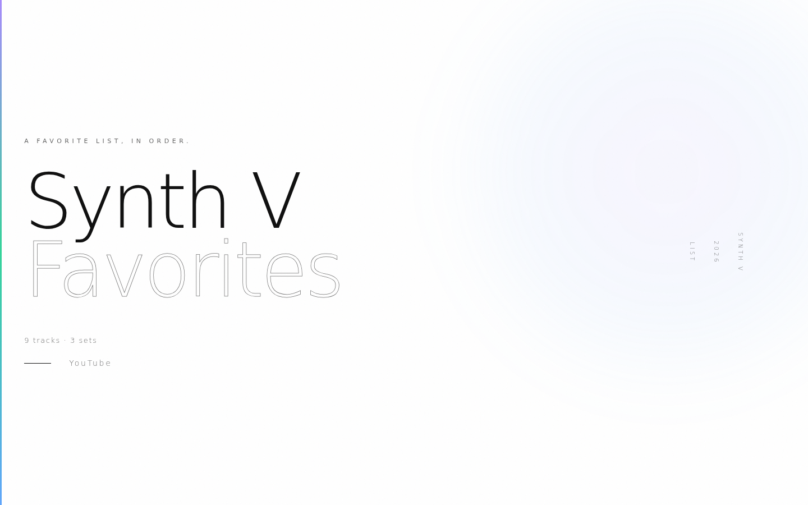
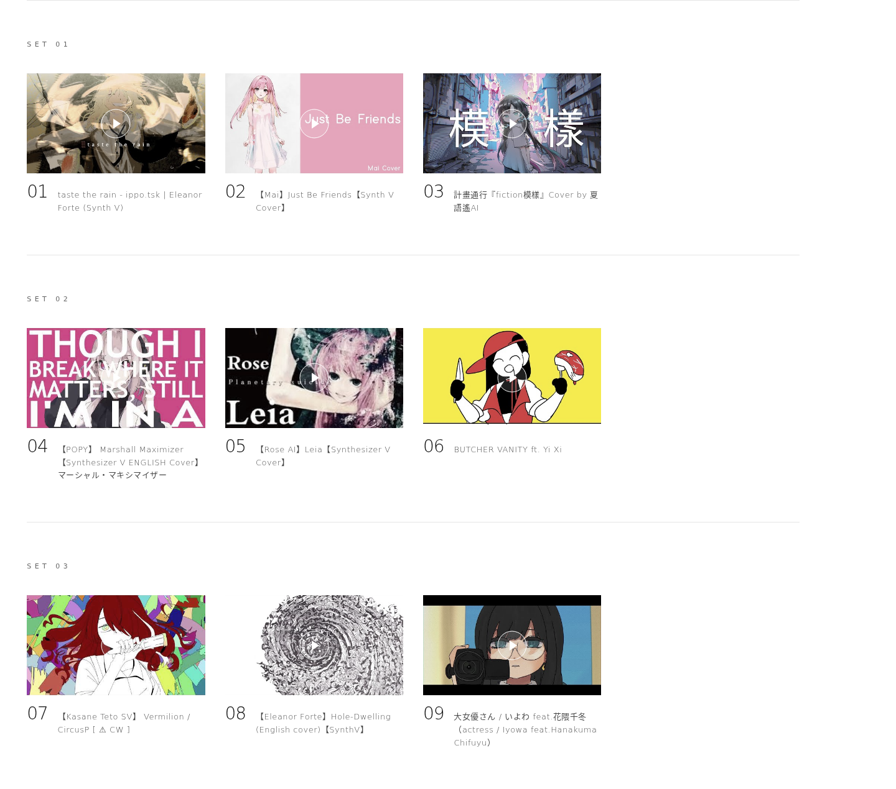
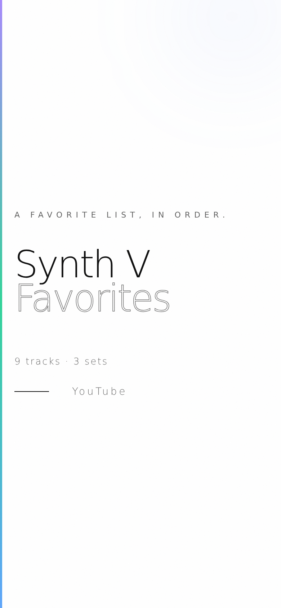
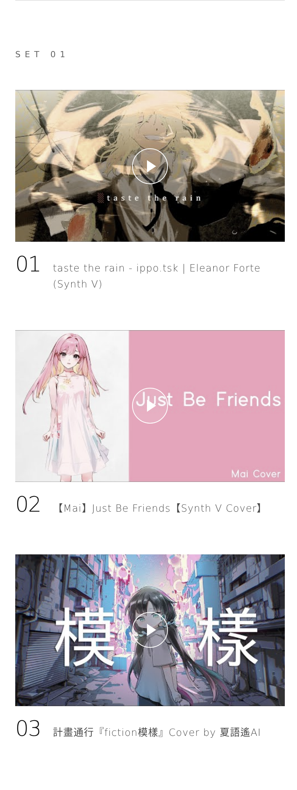

# Synth V Favorites

[English](README.md) | [简体中文](README.zh-CN.md) | 繁體中文

一份由 Synthesizer V 演唱的私人歌單，收錄原創曲與翻唱曲，直接從 YouTube 播放，依固定順序排列。

線上收聽：**[https://voca-synth.github.io/my-synthv-list/](https://voca-synth.github.io/my-synthv-list/)**，也可以[製作你自己的歌單](#製作你自己的歌單)。



## 曲目

共九首，分為三組，建議依序聆聽。曲名保留原曲語言，後附通行的英文或日文標題。歌手名以日文和英文標示，中文歌手保留中文名，常見的中文譯名寫在括號裡。

| 組 | # | | 曲名 | 歌手 | 原創 / 翻唱 |
|---|---|---|---|---|---|
| 01 | 01 | <a href="https://www.youtube.com/watch?v=H7_1LDku7sg"></a> | [taste the rain](https://www.youtube.com/watch?v=H7_1LDku7sg) | エレノア・フォルテ / Eleanor Forte | ippo.tsk 原創 |
| 01 | 02 | <a href="https://www.youtube.com/watch?v=KUy2Es4d4CQ"></a> | [Just Be Friends](https://www.youtube.com/watch?v=KUy2Es4d4CQ) | Mai | 翻唱，原曲 Dixie Flatline feat. 巡音ルカ（巡音流歌）。調校：Jim |
| 01 | 03 | <a href="https://www.youtube.com/watch?v=By-a9NeeHzE"></a> | [fiction模樣](https://www.youtube.com/watch?v=By-a9NeeHzE) | 夏語遙 / Xia Yuyao | 翻唱，原曲為台灣樂團 計畫通行。調校：Hugwalk（VOICEMITH） |
| 02 | 04 | <a href="https://www.youtube.com/watch?v=cQLzNtaZTxw"></a> | [マーシャル・マキシマイザー (Marshall Maximizer)](https://www.youtube.com/watch?v=cQLzNtaZTxw) | POPY | 英文翻唱，原曲 柊マグネタイト (Hiiragi Magnetite) feat. 可不 (KAFU)。英文詞：Bread Box，調校：LuvP |
| 02 | 05 | <a href="https://www.youtube.com/watch?v=74rKqbs-E1Y"></a> | [Leia](https://www.youtube.com/watch?v=74rKqbs-E1Y) | ROSE | 翻唱，原曲 ゆよゆっぺ (Yuyoyuppe) feat. 巡音ルカ（巡音流歌）。調校：連殤 |
| 02 | 06 | <a href="https://www.youtube.com/watch?v=vjBFftpQxxM"></a> | [BUTCHER VANITY](https://www.youtube.com/watch?v=vjBFftpQxxM) | 奕夕 / Yi Xi | FLAVOR FOLEY（Vane Lily、Jamie Paige、ricedeity）原創 |
| 03 | 07 | <a href="https://www.youtube.com/watch?v=wFLn_d51bNc"></a> | [Vermilion](https://www.youtube.com/watch?v=wFLn_d51bNc) | 重音テト（重音Teto）/ Kasane Teto | Circus (CircusP) 原創，收錄於專輯 DAEMON/DOLL |
| 03 | 08 | <a href="https://www.youtube.com/watch?v=jU_CG_FF6WI"></a> | [あなぐらぐらし (Hole-Dwelling)](https://www.youtube.com/watch?v=jU_CG_FF6WI) | エレノア・フォルテ / Eleanor Forte | 英文翻唱，原曲 Kikuo feat. 初音ミク（初音未來）。英文詞與調校：GumiWorms |
| 03 | 09 | <a href="https://www.youtube.com/watch?v=wdNjJ3eh8EQ"></a> | [大女優さん (actress)](https://www.youtube.com/watch?v=wdNjJ3eh8EQ) | 花隈千冬 / Hanakuma Chifuyu | いよわ (Iyowa) 原創 |

以上歌手皆為 Synthesizer V 聲庫。被翻唱曲目的原唱是 VOCALOID 或 CeVIO 聲庫，只有 計畫通行 的原曲由樂團主唱本人演唱。



## 初衷

Synthesizer V 的作品分散在各個頻道、語言和曲風裡，喜歡的歌很容易埋沒在觀看紀錄和零散的播放清單中。這個頁面把幾首最喜歡的歌放在一起，依想聽的順序排好，並註明每一位創作者。

## 快速開始

需要 Node.js 18.20 以上（建議 20 以上）。

```sh
npm install
npm run dev        # 本機預覽：http://localhost:4321
npm run build      # 產生靜態網站到 dist/
npm run preview    # 在本機預覽建置結果
```

`dist/` 是純靜態檔案，可以部署到任何靜態託管服務。本儲存庫每次推送到 `main` 都會自動部署到 GitHub Pages。

### 編輯歌單

歌單儲存在 `tracklist.txt` 中，每行一部影片：

```text
https://www.youtube.com/watch?v=VIDEO_ID, 頁面上顯示的標題
```

檔案中的順序就是頁面上的順序。空行表示新的一組，以 `#` 開頭的行會被忽略。修改後重新建置即可。

## 製作你自己的歌單

每個人喜歡的歌都不一樣。本專案是開源的，你可以用它做一個屬於自己的歌單頁面。不限於 Synthesizer V，VOCALOID、UTAU、CeVIO 或任何 YouTube 影片都可以。

1. 點擊 [Use this template](https://github.com/new?template_name=my-synthv-list&template_owner=voca-synth)，建立一份歷史乾淨的副本，並取一個你自己的名字。如果想保留與本儲存庫的關聯，也可以 [fork](https://github.com/voca-synth/my-synthv-list/fork)。
2. 把 `tracklist.txt` 裡的影片換成你喜歡的，依你的想法分組。
3. 在 `src/pages/index.astro` 中修改頁面標題和大標題。
4. 在 `astro.config.mjs` 中，把 `site` 改為 `https://<你的使用者名稱>.github.io`，把 `base` 改為 `/<你的儲存庫名稱>`。
5. 在你的儲存庫中進入 Settings → Pages，把 Source 設為 GitHub Actions。如果是 fork 的，fork 預設不執行工作流程，還需要在 Actions 分頁中啟用。之後每次推送到 `main`，頁面都會自動更新。

上線後歡迎分享。在本儲存庫提交一個附上連結的 issue，讓更多人看到；也可以把頁面傳給你收錄的創作者，他們通常會很高興知道有人喜歡自己的作品。對網站本身的改進，歡迎提交 pull request。發布之前請先閱讀[免責聲明](#免責聲明)：你對自己歌單中分享的內容負責。

## 手機版

 

## 免責聲明

這是一份非官方的粉絲歌單，與 Dreamtonics、YouTube 或 Google、任何聲庫開發商或發行商，以及文中提到的任何音樂人、聲源提供者或頻道均無關聯，也未獲得其贊助或認可。所有歌曲、翻唱、插畫和影片的權利歸各自的創作者和權利人所有。

Synthesizer V 是 Dreamtonics Co., Ltd. 的商標。VOCALOID 是 Yamaha Corporation 的商標。YouTube 是 Google LLC 的商標。初音ミク（初音未來）和巡音ルカ（巡音流歌）是 Crypton Future Media, INC. 的商標。CeVIO 以及文中其他聲庫的名稱和角色，歸各自的開發商和權利人所有。其他商標歸其各自所有者所有。文中使用這些名稱僅用於識別和署名，不代表任何認可關係。

本站不託管、不轉載任何音訊或影片，只連結並嵌入原始上傳，播放次數會計入創作者的影片。縮圖來自 YouTube，點擊播放後會載入 YouTube 的隱私強化模式播放器（`youtube-nocookie.com`），適用 YouTube 的服務條款和隱私權政策。

第 07 首的上傳者標註了內容警告，觀看前請先閱讀影片說明。第 04 首已被上傳者設為不公開，可以從本歌單播放，但在 YouTube 搜尋中找不到。署名資訊取自 2026 年 9 月的影片說明和原始上傳，影片隨時可能被刪除或設為私人。如果你是創作者，希望把作品從歌單中移除，請提交 issue 或寄信至 `scuba-had-goofy[at]duck.com`。

其他人使用本專案製作的歌單歸其作者所有。我們不審核、不託管、也不認可這些歌單，對其內容不承擔任何責任，包括在本儲存庫的 issue 中分享的連結。如果你製作歌單，請自行判斷並確認所分享的內容：影片是官方或經授權的上傳，署名資訊正確，必要的內容警告已標註，頁面遵守 YouTube 的服務條款和你所在地區的法律。程式碼依授權條款所述「按原樣」提供，不附帶任何形式的擔保。

## 授權條款

Copyright © 2026 Voca Synth（[github.com/didvc](https://github.com/didvc)）。本站程式碼採用 [GNU AGPL-3.0](LICENSE) 授權條款（SPDX：`AGPL-3.0-only`）。該授權條款不適用於文中列出的歌曲、影片和插畫。授權範圍、第三方服務和商標說明見 [NOTICE](NOTICE)。

聯絡方式：提交 issue，或寄信至 `scuba-had-goofy[at]duck.com`。
